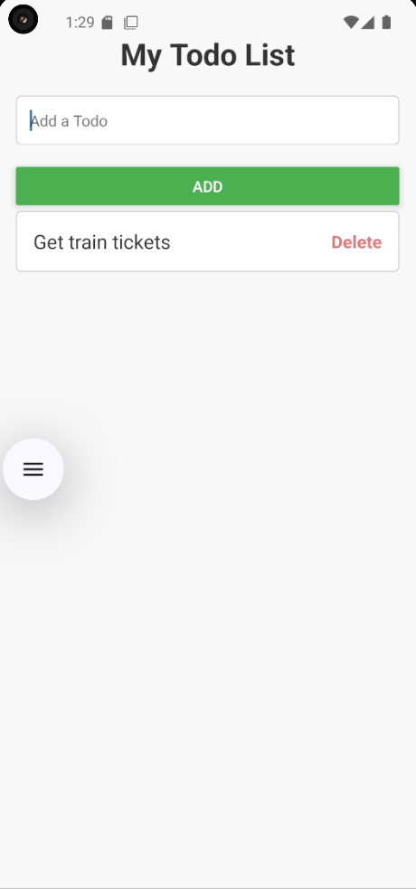

# Todo List - React Native 📝

## Description

This is a simple Todo List application built with React Native. The app allows users to add, view, and delete tasks (todos). It is designed to work smoothly on both Android and iOS devices. 📱💻

## Features ✨

- Add tasks to the list ➕
- Delete tasks from the list ❌
- Simple, clean, and intuitive interface 🌟

## Screenshots 📸

Here are some screenshots of the app in action:

### Main Screen

## Requirements ⚙️

Before you begin, ensure you have the following installed on your machine:

- [Node.js](https://nodejs.org/) (LTS version recommended) 🌐
- [Expo CLI](https://docs.expo.dev/get-started/installation/) (for easier React Native development) 🚀
- [Git](https://git-scm.com/) (for version control) 💻
- [Android Studio](https://developer.android.com/studio) or [Xcode](https://developer.apple.com/xcode/) (for emulation on Android or iOS) 📱
